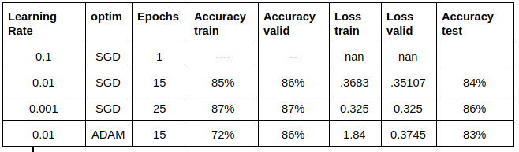
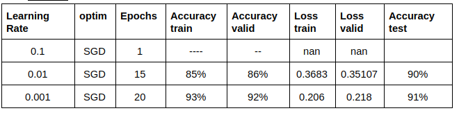

# MSDS19064_COVID19_DLSpring2020
“This repository contains code and results for COVID-19 classification assignment by Deep Learning Spring 2020 course offered at Information Technology University, Lahore, Pakistan. This assignment is only for learning purposes and is not intended to be used for clinical purposes.”

## Dataset

[COVID-19 dataset](https://drive.google.com/file/d/1-HQQciKYfwAO3oH7ci6zhg45DduvkpnK/view)
## Training of a model

[Model Saved files](https://drive.google.com/drive/folders/1iP_GYIFeSPamiVFyIi45ReaBrm423iu4?usp=sharing)

### Task 1
In this task only fine tuned fully connected layers

#### Resnet18 results
##### Model

##### Confusion Matrix

#### VGG16 results
##### Model 

##### Confusion Matrix

### Task 2
In this task finetuned complete model with existing weights

#### Resnet18 results
##### Model

##### Confusion Matrix

#### VGG16 results

##### Model 

##### Confusion Matrix

